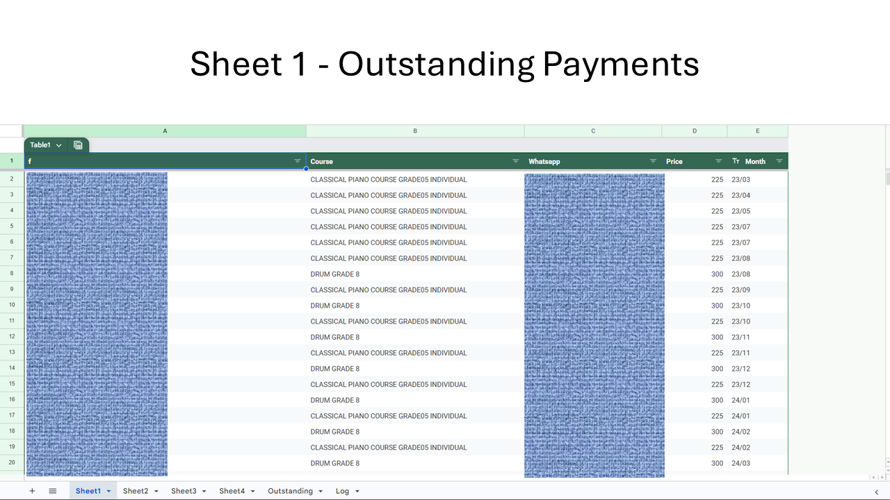
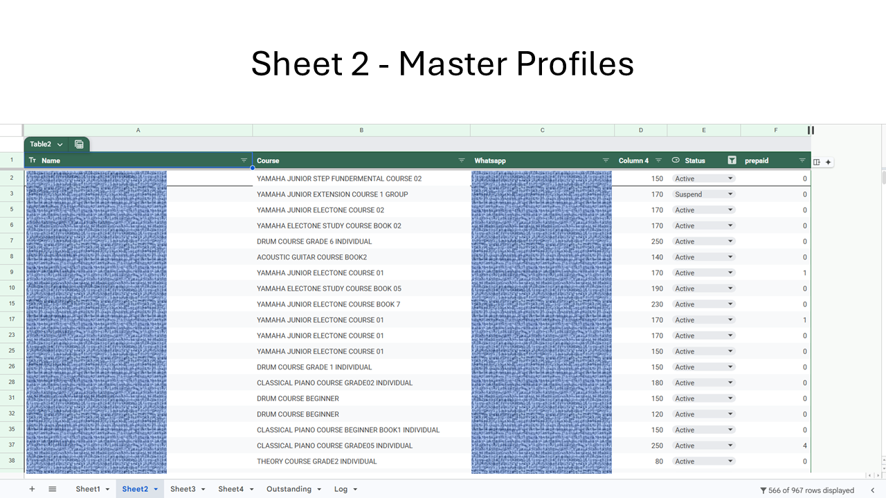
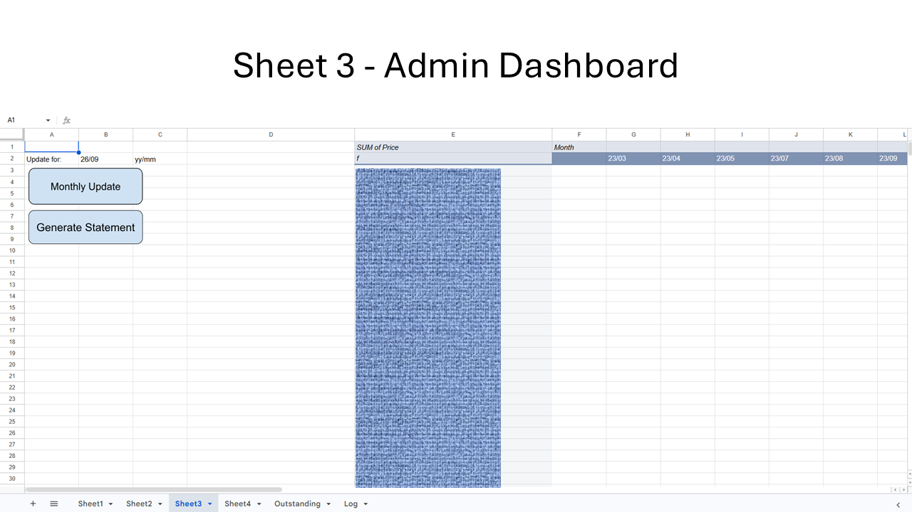
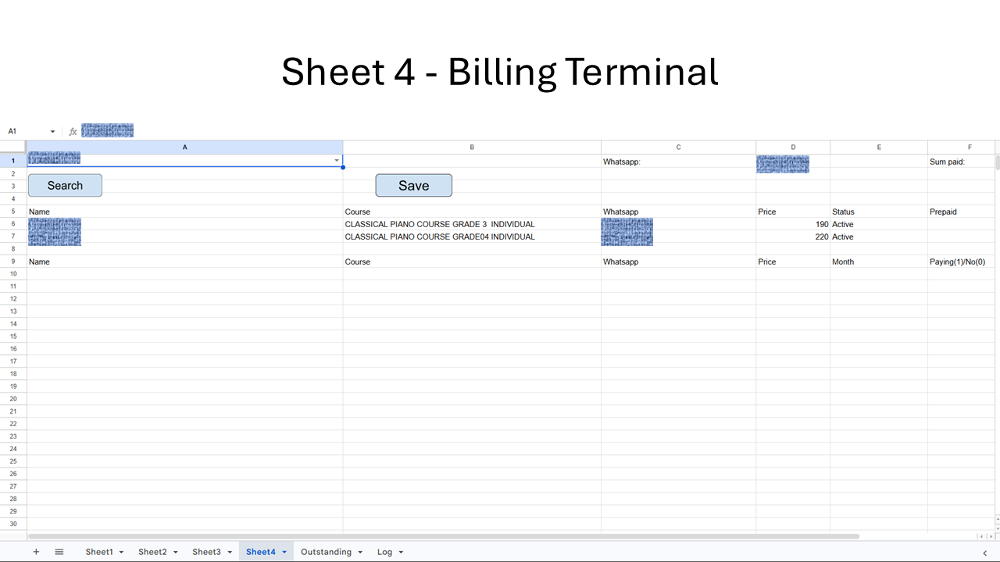
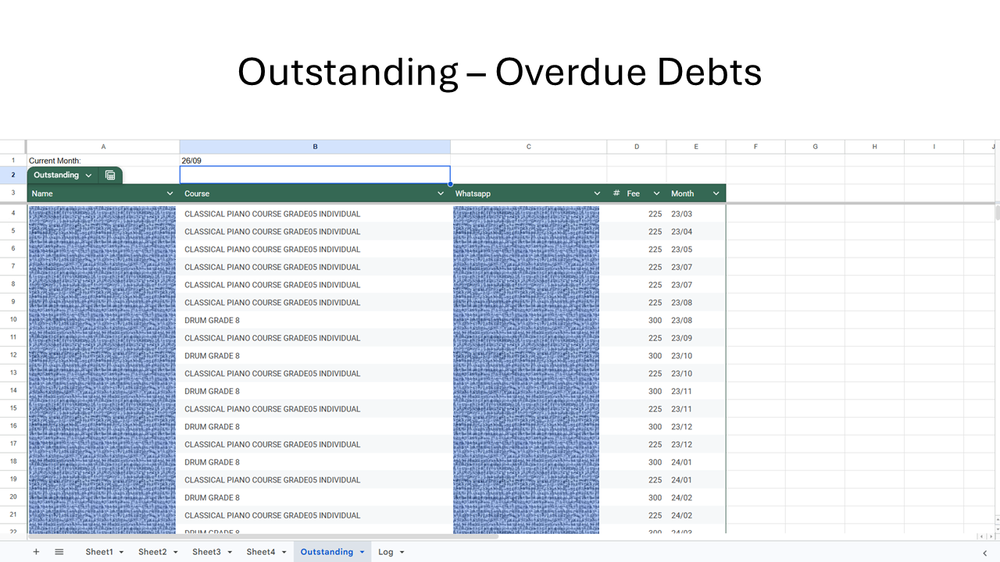
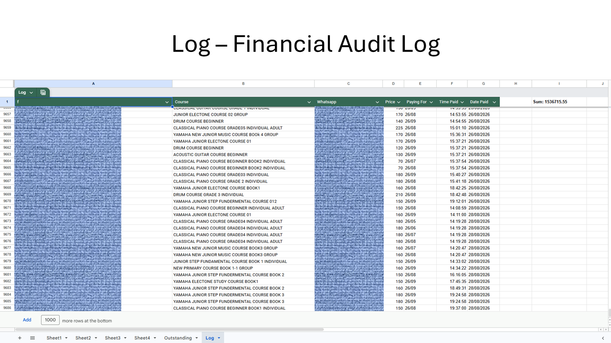
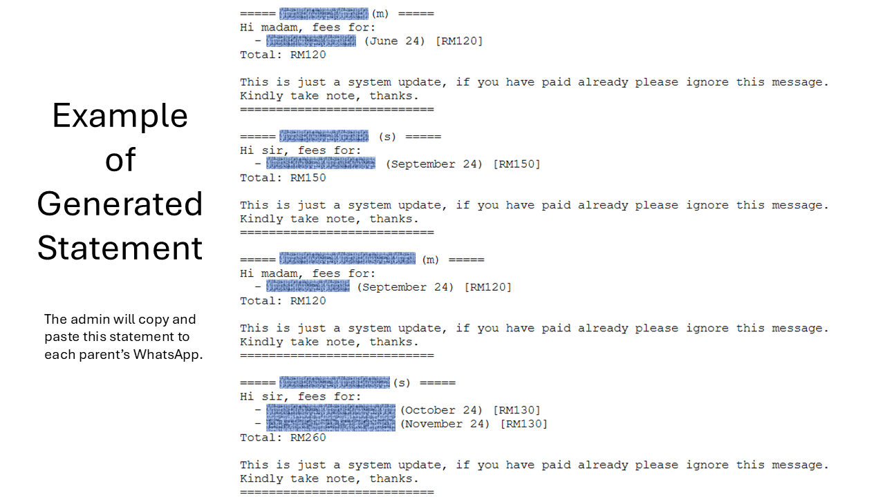
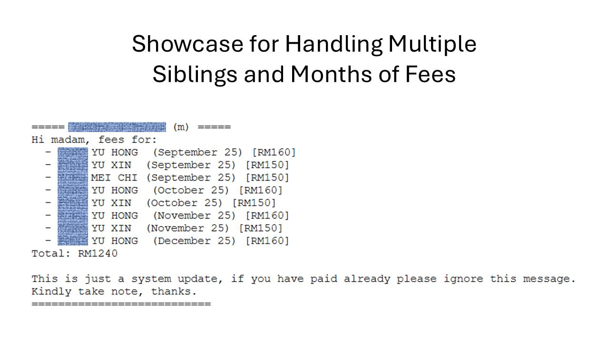

# Yamaha Music School (Jazz Music Melaka) Fees & Billing Management System

An automated Google Sheets and Apps Script system custom-built for **Jazz Music (Yamaha Music School, Melaka branch)**. Deployed and actively running as the school's primary payment terminal since **2023** (3+ years in continuous production).

---

## Production Impact & Performance

* **Organization:** Jazz Music (Yamaha Music School, Melaka Branch)
* **Status:** In Production (3+ Years Active, zero downtime)
* **Scope:** Automates billing for hundreds of active students across Yamaha New Primary Course, Piano, Drum, Guitar, and Violin programs.
* **Core Value:** Streamlines multi-student family accounts, automates month-to-month rollover invoices, tracks prepaid balances, and formats instant WhatsApp billing notifications.

---

## Detailed Technical Architecture & System Workflow


```

[ User Interaction Layer ]
│
├── Google Sheets UI (Cell Edit on A1) ──> Apps Script Event (onEdit Trigger)
│                                                 │
├── Action Buttons (Drawing Objects) ─────────────┼────────┐
│     (Search / Save / Roll / Draft)              │        │
│                                                 ▼        ▼
[ Apps Script Execution Layer (Code.gs) ]    ┌────────────────────────┐
│                                            │ Data Validation Engine │
│                                            └────────────────────────┘
├── search()  ──> Query Master & Pending Dues
├── save()    ──> Process Dues/Prepaid & Append Log
├── monthlyUpdate()  ──> Rollover & Deduct Prepaid
└── generateStatement() ──> Aggregate & Format Text
│
▼
[ Data & Persistence Layer (Google Sheets API Engine) ]
│
├── Sheet2 (Master Profiles)  <── Read/Write (Prepaid Counter)
├── Sheet1 (Outstanding Dues) <── Read/Write (Active Invoices)
├── Log (Audit Trail)        <── Append Only (Timestamped Dues Cleared)
└── Outstanding (Sheet)      <── Dynamic Range Query =FILTER(Sheet1!...)
│
▼
[ External Integration Layer ]
└── Google Drive API ──> Generate Plain-Text WhatsApp Drafts

```

### Detailed Component Breakdown

#### 1. Real-Time Data Validation (`onEdit`)
When an administrator interacts with `Sheet4!A1`, the system intercepts the simple event trigger (`e`). If dynamic validation is unassigned, it dynamically binds a criteria rule referencing `Sheet2!A2:A` to enforce clean student data entry without explicit manual setup.

#### 2. Search & Relational Aggregation (`search`)
When `search()` is invoked:
1. Reads selected student from `Sheet4!A1`.
2. Resolves parent contact metadata by matching the primary key via `Sheet2` (`Table2`).
3. Executes in-memory filtering across `Sheet2` (active profile enrollment) and `Sheet1` (outstanding invoices) matching the shared WhatsApp phone number.
4. Dynamically builds dynamic spreadsheet formulas (`=SUM(...)`, `=SUMIF(...)`, `=VLOOKUP(...)`) into array buffers before writing back to `Sheet4` in a single bulk operation.

#### 3. Transaction Execution & State Updates (`save`)
When `save()` is executed:
* **Prepaid Branch:** Calculates payment top-ups, increments the prepaid months integer in `Sheet2`, and creates multi-month forward audit entries in `Log`.
* **Invoice Settlement Branch:** Filters checked line items, removes matching invoice entries from `Sheet1`, and appends formatted execution records to `Log` with `GMT+8` timestamps (`HH:mm:ss`, `dd/MM/yyyy`).
* **State Reset:** Writes updated arrays back to `Sheet1`, `Sheet2`, `Sheet4`, and `Log` while clearing old terminal UI fields.

#### 4. Automated Monthly Rollover (`monthlyUpdate`)
Scans all registered courses in `Sheet2`:
* **If `prepaid > 0`:** Decrements credit by 1 month (`prepaid--`). No entry added to `Sheet1`.
* **If `prepaid == 0` & `Status == "Active"`:** Generates a new unpaid fee item for the specified target month (`yy/mm`) and appends it to `Sheet1`.

#### 5. WhatsApp Statement Generator (`generateStatement`)
1. Fetches all outstanding records from `Sheet1`.
2. Groups line items into an associative map keying by WhatsApp identifier.
3. Parses honorifics (`madam` vs `sir` based on contact patterns) and formats localized string buffers containing itemized breakdowns, month identifiers, and calculated totals (RM).
4. Interacts with `DriveApp` to create or update a plain-text document (`Statement Yamaha`) in Google Drive for direct copy-pasting to WhatsApp broadcast lists.

---

## Data Model (Sheet Architecture)

| Sheet Name | Role | Key Fields / Formulas |
| :--- | :--- | :--- |
| **Sheet1** | Outstanding Invoices | `Name`, `Course`, `Whatsapp`, `Price`, `Month` |
| **Sheet2** | Master Profiles | `Name`, `Course`, `Whatsapp`, `Price`, `Status`, `Prepaid Months` |
| **Sheet3** | Dashboard / Admin | Control triggers (`Monthly Update`, `Generate Statement`) |
| **Sheet4** | Billing Terminal UI | Interactive search UI, settlement form, dynamic calculation cells |
| **Outstanding** | Overdue Debts (>2 Mos) | `=FILTER(Sheet1!A2:E, Sheet1!E2:E < $B1)` |
| **Log** | Financial Audit Log | `Name`, `Course`, `Whatsapp`, `Price`, `Paying For`, `Time`, `Date` |

---

## System Screenshots & UI Flow

### User Interface & Sheet Modules


*Active list tracking unpaid monthly course fees.*

---


*Master directory mapping student course enrollments to prepaid month balances.*

---


*Operational control panel housing the system trigger buttons (`Monthly Update` & `Generate Statement`).*

---


*Main cashier interface for dynamic student search, family aggregation, and payment settlement.*

---


*Filter-driven view isolating payments overdue by more than 2 months.*

---


*Append-only transaction ledger recording all settled payments with GMT+8 timestamps.*

---

### Generated Output Samples


*Plain-text statements drafted automatically into Google Drive with parent honorific recognition (`sir` / `madam`).*

---


*Demonstrates how the system dynamically groups multiple children under a single parent account and itemizes several months of unpaid fees into one unified balance.*

---

## Setup & Deployment

1. **Create Sheet Structure:** Prepare sheets named `Sheet1`, `Sheet2`, `Sheet3`, `Sheet4`, `Outstanding`, and `Log` following the schema above.
2. **Open Apps Script Editor:** Navigate to **Extensions > Apps Script**.
3. **Deploy Code:** Copy the contents of `Code.gs` into your Apps Script editor.
4. **Bind UI Triggers:**
   * On `Sheet4`, assign `search` to the **Search** button drawing object and `save` to the **Save** button.
   * On `Sheet3`, assign `monthlyUpdate` to the **Monthly Update** button drawing object and `generateStatement` to the **Generate Statement** button.
